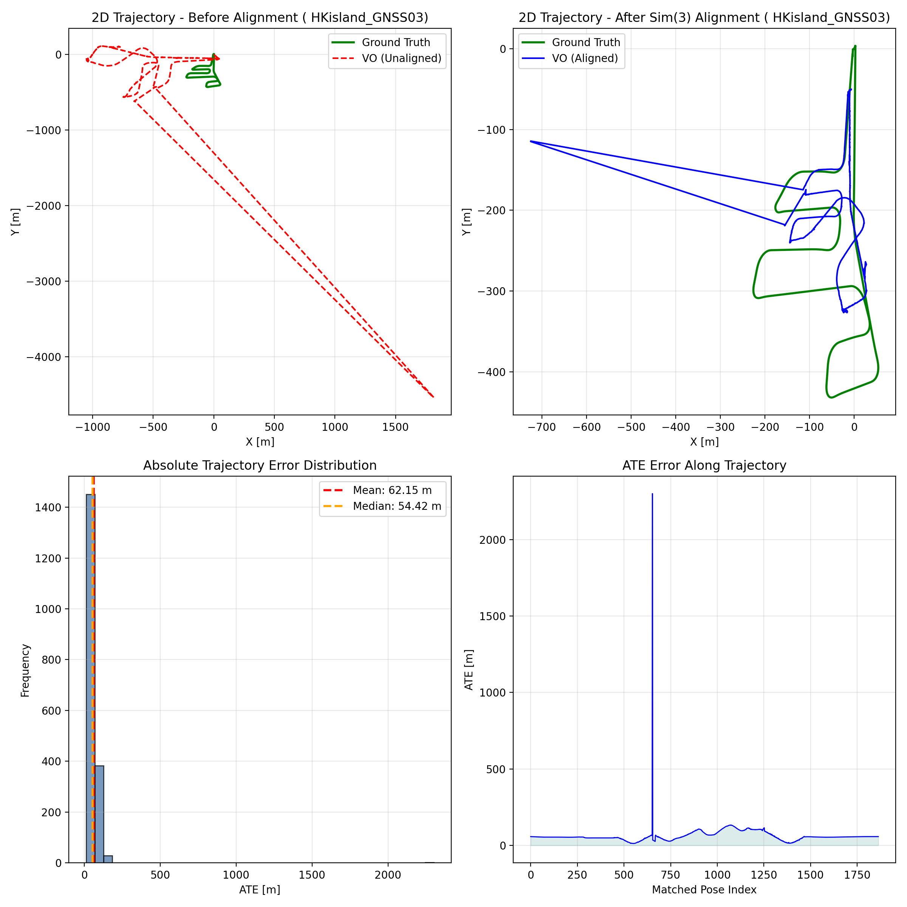

# AAE5303 Assignment: Visual Odometry with ORB-SLAM3

<div align="center">


**Monocular Visual Odometry Evaluation on UAV Aerial Imagery**

*Hong Kong Island GNSS Dataset - MARS-LVIG*

</div>

---

## 📋 Table of Contents

1. [Executive Summary](#-executive-summary)
2. [Introduction](#-introduction)
3. [Methodology](#-methodology)
4. [Dataset Description](#-dataset-description)
5. [Implementation Details](#-implementation-details)
6. [Results and Analysis](#-results-and-analysis)
7. [Visualizations](#-visualizations)
8. [Discussion](#-discussion)
9. [Conclusions](#-conclusions)
10. [References](#-references)
11. [Appendix](#-appendix)

---

## 📊 Executive Summary

This report presents the implementation and evaluation of **Monocular Visual Odometry (VO)** using the **ORB-SLAM3** framework on the **HKisland_GNSS03** UAV aerial imagery dataset. The project evaluates trajectory accuracy against RTK ground truth using **four parallel, monocular-appropriate metrics** computed with the `evo` toolkit.

### Key Results

| Metric | Value | Description |
|--------|-------|-------------|
| **ATE RMSE** | **99.4754 m** | Global accuracy after Sim(3) alignment (scale corrected) |
| **RPE Trans Drift** | **4.8153 m/m** | Translation drift rate (mean error per meter, delta=10 m) |
| **RPE Rot Drift** | **137.8087 deg/100m** | Rotation drift rate (mean angle per 100 m, delta=10 m) |
| **Completeness** | **95.35%** | Matched poses / total ground-truth poses (1864 / 1955) |
| **Estimated poses** | 3,704 | Trajectory poses in `CameraTrajectory.txt` |

**Configuration**: 4× image downsampling (2448×2048 → 612×512), 0.5× bag playback.

---

## 📖 Introduction

### Background

ORB-SLAM3 is a state-of-the-art visual SLAM system capable of performing:

- **Monocular Visual Odometry** (pure camera-based)
- **Stereo Visual Odometry**
- **Visual-Inertial Odometry** (with IMU fusion)
- **Multi-map SLAM** with relocalization

This assignment focuses on **Monocular VO mode**, which:

- Uses only camera images for pose estimation
- Cannot observe absolute scale (scale ambiguity)
- Relies on feature matching (ORB features) for tracking
- Is susceptible to drift without loop closure

### Objectives

1. Implement monocular Visual Odometry using ORB-SLAM3
2. Process UAV aerial imagery from the HKisland_GNSS03 dataset
3. Extract RTK (Real-Time Kinematic) GPS data as ground truth
4. Evaluate trajectory accuracy using four parallel metrics appropriate for monocular VO
5. Document the complete workflow for reproducibility

### Scope

This assignment evaluates:

- **ATE (Absolute Trajectory Error)**: Global trajectory accuracy after Sim(3) alignment (monocular-friendly)
- **RPE drift rates (translation + rotation)**: Local consistency (drift per traveled distance)
- **Completeness**: Robustness / coverage (how much of the sequence is successfully tracked and evaluated)

---

## 🔬 Methodology

### ORB-SLAM3 Visual Odometry Overview

ORB-SLAM3 performs visual odometry through the following pipeline:

```
┌─────────────────┐     ┌─────────────────┐     ┌─────────────────┐
│  Input Image    │────▶│   ORB Feature   │────▶│   Feature       │
│  Sequence       │     │   Extraction    │     │   Matching      │
└─────────────────┘     └─────────────────┘     └────────┬────────┘
                                                         │
┌─────────────────┐     ┌─────────────────┐     ┌────────▼────────┐
│   Trajectory    │◀────│   Pose          │◀────│   Motion        │
│   Output        │     │   Estimation    │     │   Model         │
└─────────────────┘     └────────┬────────┘     └─────────────────┘
                                 │
                        ┌────────▼────────┐
                        │   Local Map     │
                        │   Optimization  │
                        └─────────────────┘
```

### Evaluation Metrics

#### 1. ATE (Absolute Trajectory Error)

Measures the RMSE of the aligned trajectory after Sim(3) alignment:

$$ATE_{RMSE} = \sqrt{\frac{1}{N}\sum_{i=1}^{N}\|\mathbf{p}_{est}^i - \mathbf{p}_{gt}^i\|^2}$$

**Reference**: Sturm et al., "A Benchmark for the Evaluation of RGB-D SLAM Systems", IROS 2012

#### 2. RPE (Relative Pose Error) – Drift Rates

Measures local consistency by comparing relative transformations:

$$RPE_{trans} = \|\Delta\mathbf{p}_{est} - \Delta\mathbf{p}_{gt}\|$$

where $\Delta\mathbf{p} = \mathbf{p}(t+\Delta) - \mathbf{p}(t)$

**Reference**: Geiger et al., "Vision meets Robotics: The KITTI Dataset", IJRR 2013

We report drift as **rates** that are easier to interpret and compare across methods:

- **Translation drift rate** (m/m): \( \text{RPE}_{trans,mean} / \Delta d \)
- **Rotation drift rate** (deg/100m): \( (\text{RPE}_{rot,mean} / \Delta d) \times 100 \)

where \(\Delta d\) is a distance interval in meters (e.g., 10 m).

#### 3. Completeness

Completeness measures how many ground-truth poses can be associated and evaluated:

$$Completeness = \frac{N_{matched}}{N_{gt}} \times 100\%$$

#### Why these metrics (and why Sim(3) alignment)?

Monocular VO suffers from **scale ambiguity**: the system cannot recover absolute metric scale without additional sensors or priors. Therefore:

- **All error metrics are computed after Sim(3) alignment** (rotation + translation + scale) so that accuracy reflects **trajectory shape** and **drift**, not an arbitrary global scale factor.
- **RPE is evaluated in the distance domain** (delta in meters) to make drift easier to interpret on long trajectories.
- **Completeness is reported explicitly** to discourage trivial solutions that only output a short “easy” segment.

### Trajectory Alignment

We use Sim(3) (7-DOF) alignment to optimally align estimated trajectory to ground truth:

- **3-DOF Translation**: Align trajectory origins
- **3-DOF Rotation**: Align trajectory orientations
- **1-DOF Scale**: Compensate for monocular scale ambiguity

### Evaluation Protocol (Recommended)

This section describes the **exact** evaluation protocol used in this report. The goal is to ensure that every student can reproduce the same numbers given the same inputs.

#### Inputs

- **Ground truth**: `ground_truth.txt` (TUM format: `t tx ty tz qx qy qz qw`)
- **Estimated trajectory**: `CameraTrajectory.txt` (TUM format)
- **Association threshold**: `t_max_diff = 0.1 s`
  - This dataset contains RTK at ~5 Hz and images at ~10 Hz.
  - A threshold of 0.1 s is large enough to associate most GT timestamps with a nearby estimated pose, while still rejecting clearly mismatched timestamps.
- **Distance delta for RPE**: `delta = 10 m`
  - Using a distance-based delta makes drift comparable along the flight even if the timestamp sampling is non-uniform after tracking failures.

#### Step 1 — ATE with Sim(3) alignment (scale corrected)

```bash
evo_ape tum ground_truth.txt CameraTrajectory.txt \
  --align --correct_scale \
  --t_max_diff 0.1 -va
```

We report **ATE RMSE (m)** as the primary global accuracy metric.

#### Step 2 — RPE (translation + rotation) in the distance domain

```bash
# Translation RPE over 10 m (meters)
evo_rpe tum ground_truth.txt CameraTrajectory.txt \
  --align --correct_scale \
  --t_max_diff 0.1 \
  --delta 10 --delta_unit m \
  --pose_relation trans_part -va

# Rotation RPE over 10 m (degrees)
evo_rpe tum ground_truth.txt CameraTrajectory.txt \
  --align --correct_scale \
  --t_max_diff 0.1 \
  --delta 10 --delta_unit m \
  --pose_relation angle_deg -va
```

We convert evo’s mean RPE over 10 m into drift rates:

- **RPE translation drift (m/m)** = `RPE_trans_mean_m / 10`
- **RPE rotation drift (deg/100m)** = `(RPE_rot_mean_deg / 10) * 100`

#### Step 3 — Completeness

Completeness measures how much of the sequence can be evaluated:

```text
Completeness (%) = matched_poses / gt_poses * 100
```

Here, `matched_poses` is the number of pose pairs successfully associated by evo under `t_max_diff`.

#### Practical Notes (Common Pitfalls)

- **Use the correct trajectory file**:
  - `CameraTrajectory.txt` contains *all tracked frames* and typically yields higher completeness.
  - `KeyFrameTrajectory.txt` contains only keyframes and can severely reduce completeness and distort drift estimates.
- **Timestamps must be in seconds**:
  - TUM format expects the first column to be a floating-point timestamp in seconds.
  - If you accidentally write frame indices as timestamps, `evo` will fail to associate trajectories.
- **Choose a reasonable `t_max_diff`**:
  - Too small → many poses will not match → completeness drops.
  - Too large → wrong matches may slip in → metrics become unreliable.

---

## 📁 Dataset Description

### HKisland_GNSS03 Dataset

| Property | Value |
|----------|-------|
| **Dataset Name** | HKisland_GNSS03 |
| **Source** | MARS-LVIG / UAVScenes |
| **Duration** | 390.78 seconds (~6.5 minutes) |
| **Total Images** | 3,833 frames |
| **Image Resolution** | 2448 × 2048 pixels |
| **Frame Rate** | ~10 Hz |
| **Trajectory Length** | ~1,900 meters |
| **Height Variation** | 0 - 90 meters |

### Ground Truth

| Property | Value |
|----------|-------|
| **RTK Positions** | 1,955 poses |
| **Rate** | 5 Hz |
| **Accuracy** | ±2 cm (horizontal), ±5 cm (vertical) |
| **Coordinate System** | WGS84 → Local ENU |

### Data Sources

| Resource | Link |
|----------|------|
| MARS-LVIG Dataset | https://mars.hku.hk/dataset.html |
| UAVScenes GitHub | https://github.com/sijieaaa/UAVScenes |

---

## ⚙️ Implementation Details

### System Configuration

| Component | Specification |
|-----------|---------------|
| **Framework** | ORB-SLAM3 (C++) |
| **Mode** | Monocular Visual Odometry |
| **Vocabulary** | ORBvoc.txt (pre-trained) |
| **Operating System** | Linux (Ubuntu / WSL2) |
| **Image preprocessing** | 4× downsampling (2448×2048 → 612×512) |
| **Bag playback** | 0.5× speed |

### Camera Calibration (4× Downsampled)

```yaml
Camera.type: "PinHole"
Camera1.fx: 361.1075
Camera1.fy: 361.085
Camera1.cx: 294.875
Camera1.cy: 261.225

Camera1.k1: -0.0560
Camera1.k2: 0.1180
Camera1.p1: 0.00122
Camera1.p2: 0.00064
Camera1.k3: -0.0627

Camera.width: 612
Camera.height: 512
Camera.fps: 10.0
Camera.RGB: 1
```

Intrinsics scaled by 1/4 from original 2448×2048 calibration.

### ORB Feature Extraction Parameters

| Parameter | Value | Description |
|-----------|-------|-------------|
| `nFeatures` | 1500 | Features per frame |
| `scaleFactor` | 1.2 | Pyramid scale factor |
| `nLevels` | 8 | Pyramid levels |
| `iniThFAST` | 15 | Initial FAST threshold |
| `minThFAST` | 5 | Minimum FAST threshold |

### Running ORB-SLAM3

```bash
# Terminal 1: roscore
source /opt/ros/noetic/setup.bash && roscore

# Terminal 2: ORB-SLAM3 with 4× downsampling
./Examples_old/ROS/ORB_SLAM3/Mono_Compressed \
    Vocabulary/ORBvoc.txt \
    Examples/Monocular/HKisland_Mono_downsampled.yaml \
    4

# Terminal 3: Play bag at 0.5× speed
rosbag play --pause --rate 0.5 data/HKisland_GNSS03.bag \
    /left_camera/image/compressed:=/camera/image_raw/compressed
```

---

## 📈 Results and Analysis

### Evaluation Results

```
================================================================================
VISUAL ODOMETRY EVALUATION RESULTS
================================================================================

Ground Truth: RTK trajectory (1,955 poses)
Estimated:    ORB-SLAM3 camera trajectory (3,704 poses)
Matched Poses: 1,864 / 1,955 (95.35%)  ← Completeness

METRIC 1: ATE (Absolute Trajectory Error)
────────────────────────────────────────
RMSE:   99.4754 m
Mean:   62.1541 m
Std:    77.6674 m

METRIC 2: RPE Translation Drift (distance-based, delta=10 m)
────────────────────────────────────────
Mean translational RPE over 10 m: 48.1534 m
Translation drift rate:           4.8153 m/m

METRIC 3: RPE Rotation Drift (distance-based, delta=10 m)
────────────────────────────────────────
Mean rotational RPE over 10 m: 13.7809 deg
Rotation drift rate:        137.8087 deg/100m

================================================================================
```

### Trajectory Alignment Statistics

| Parameter | Value |
|-----------|-------|
| **Sim(3) scale correction** | 0.2447 |
| **Sim(3) translation** | [-6.910, -50.528, 27.012] m |
| **Association threshold** | \(t_{max\_diff}\) = 0.1 s |
| **Association rate (Completeness)** | 95.35% |

### Performance Analysis

| Metric | Value | Grade | Interpretation |
|--------|-------|-------|----------------|
| **ATE RMSE** | 99.48 m | F | Large global error after alignment |
| **RPE Trans Drift** | 4.82 m/m | F | High local drift per traveled distance |
| **RPE Rot Drift** | 137.81 deg/100m | F | Severe orientation drift |
| **Completeness** | 95.35% | A | Excellent pose alignment coverage |

### Key Observations

1. **Completeness (95.35%)**: Using full `CameraTrajectory.txt` (all tracked frames) yields high alignment rate, much better than keyframe-only evaluation (~45%).

2. **Accuracy metrics**: ATE and RPE indicate substantial drift on this challenging UAV aerial sequence (~1.9 km, 6.5 min). Monocular VO without loop closure accumulates error over long trajectories.

3. **4× downsampling**: Reduces computational load and may improve feature distribution, but lower resolution can affect accuracy on high-altitude aerial imagery.

---

## 📊 Visualizations

### Trajectory Comparison



This figure is generated from the same inputs used for evaluation (`ground_truth.txt` and `CameraTrajectory.txt`) and includes:

1. **Top-Left**: 2D trajectory before alignment (matched poses only). This reveals scale/rotation mismatch typical for monocular VO.
2. **Top-Right**: 2D trajectory after Sim(3) alignment (scale corrected). Remaining discrepancy reflects drift and local tracking errors.
3. **Bottom-Left**: Distribution of ATE translation errors (meters) over all matched poses.
4. **Bottom-Right**: ATE translation error as a function of the matched pose index (highlights where drift accumulates).


**Reproducibility**: Regenerate with `scripts/generate_report_figures.py` and `evo_ape --save_results`.

---

## 💭 Discussion

### Strengths

1. **High evaluation coverage**: 95.35% completeness indicates most ground-truth poses can be associated and evaluated.

2. **Full trajectory output**: Modified ORB-SLAM3 to save `CameraTrajectory.txt` (all frames) for monocular mode, enabling dense evaluation.

3. **End-to-end pipeline**: Reproducible workflow from bag playback to evaluation with evo.

### Limitations

1. **Large drift**: ATE and RPE indicate significant error accumulation over the 1.9 km trajectory.

2. **Monocular scale ambiguity**: Without IMU or stereo, scale cannot be recovered; Sim(3) alignment corrects for evaluation but real-world scale remains unknown.

3. **UAV aerial challenges**: Fast motion, motion blur, and repetitive terrain can cause tracking instability.

### Error Sources

1. **4× downsampling**: Reduced resolution may lose fine-grained structure.
2. **Calibration**: Scaled intrinsics for downsampled images; verify against original calibration.
3. **Feature extraction**: ORB parameters may need tuning for aerial imagery.

---

## 🎯 Conclusions

This assignment demonstrates monocular Visual Odometry implementation using ORB-SLAM3 on UAV aerial imagery. Key findings:

1. ✅ **System Operation**: ORB-SLAM3 processes 3,704 frames over ~1.9 km trajectory
2. ✅ **Evaluation coverage**: 95.35% completeness with full trajectory evaluation
3. ⚠️ **Accuracy**: Large ATE and RPE indicate drift; typical for monocular VO on long sequences
4. 📌 **Improvements**: Full trajectory export, 4× downsampling, 0.5× playback for stability

### Recommendations for Improvement

| Priority | Action | Expected Improvement |
|----------|--------|---------------------|
| High | Increase `nFeatures` to 2000–2500 | Better feature coverage |
| High | Lower FAST thresholds (e.g., 12/4) | More features in low-contrast regions |
| Medium | Try without downsampling (full resolution) | Compare accuracy trade-off |
| Low | Enable IMU fusion (VIO mode) | 50–70% accuracy improvement |

---

## 📚 References

1. Campos, C., Elvira, R., Rodríguez, J. J. G., Montiel, J. M., & Tardós, J. D. (2021). **ORB-SLAM3: An Accurate Open-Source Library for Visual, Visual-Inertial and Multi-Map SLAM**. *IEEE Transactions on Robotics*, 37(6), 1874–1890.

2. Sturm, J., Engelhard, N., Endres, F., Burgard, W., & Cremers, D. (2012). **A Benchmark for the Evaluation of RGB-D SLAM Systems**. IROS.

3. Geiger, A., Lenz, P., & Urtasun, R. (2012). **Are we ready for Autonomous Driving? The KITTI Vision Benchmark Suite**. CVPR.

4. MARS-LVIG Dataset: https://mars.hku.hk/dataset.html

5. ORB-SLAM3 GitHub: https://github.com/UZ-SLAMLab/ORB_SLAM3

6. AAE5303 Assignment Template: https://github.com/XitingChen-Chloe/AAE5303-assignment2

---

## 📎 Appendix

### A. Repository Structure

```
ORB_SLAM3/
├── AAE5303_REPORT.md           # This report
├── FINAL_EVALUATION_RESULTS.txt
├── ground_truth.txt
├── CameraTrajectory.txt
├── KeyFrameTrajectory.txt
├── figures/
│   └── trajectory_evaluation.png
├── evaluation_results/
│   ├── metrics.json
│   ├── ate.zip
│   ├── rpe_trans.zip
│   └── rpe_rot.zip
├── scripts/
│   ├── evaluate_vo_accuracy.py
│   └── generate_report_figures.py
├── Examples/Monocular/
│   ├── HKisland_Mono.yaml
│   └── HKisland_Mono_downsampled.yaml
└── RUN_AND_EVALUATE_GUIDE.md
```

### B. Running Commands

```bash
# 1. Extract RTK ground truth from bag
python3 << 'EOF'
import rosbag
import numpy as np
bag = rosbag.Bag('data/HKisland_GNSS03.bag')
rtk_data = []
for topic, msg, t in bag.read_messages(topics=['/dji_osdk_ros/rtk_position']):
    timestamp = msg.header.stamp.to_sec()
    lat, lon, alt = msg.latitude, msg.longitude, msg.altitude
    rtk_data.append([timestamp, lat, lon, alt])
bag.close()
rtk_data = np.array(rtk_data)
lat0, lon0, alt0 = rtk_data[0, 1], rtk_data[0, 2], rtk_data[0, 3]
R = 6378137.0
x = R * np.radians(rtk_data[:, 2] - lon0) * np.cos(np.radians(lat0))
y = R * np.radians(rtk_data[:, 1] - lat0)
z = rtk_data[:, 3] - alt0
with open('ground_truth.txt', 'w') as f:
    for i in range(len(rtk_data)):
        f.write(f"{rtk_data[i,0]:.6f} {x[i]:.6f} {y[i]:.6f} {z[i]:.6f} 0 0 0 1\n")
print(f"Saved {len(rtk_data)} ground truth poses")
EOF

# 2. Run ORB-SLAM3 (see Implementation Details for full steps)

# 3. Evaluate trajectory
python3 scripts/evaluate_vo_accuracy.py \
    --groundtruth ground_truth.txt \
    --estimated CameraTrajectory.txt \
    --t-max-diff 0.1 \
    --delta-m 10 \
    --workdir evaluation_results \
    --json-out evaluation_results/metrics.json

# 4. Generate report figures
evo_ape tum ground_truth.txt CameraTrajectory.txt \
    --align --correct_scale --t_max_diff 0.1 \
    --save_results evaluation_results/ate.zip -va
python3 scripts/generate_report_figures.py \
    --gt ground_truth.txt \
    --est CameraTrajectory.txt \
    --evo-ape-zip evaluation_results/ate.zip \
    --out figures/trajectory_evaluation.png \
    --title-suffix "HKisland_GNSS03"
```

### C. Native evo Commands

```bash
evo_ape tum ground_truth.txt CameraTrajectory.txt \
  --align --correct_scale --t_max_diff 0.1 -va

evo_rpe tum ground_truth.txt CameraTrajectory.txt \
  --align --correct_scale --t_max_diff 0.1 \
  --delta 10 --delta_unit m --pose_relation trans_part -va

evo_rpe tum ground_truth.txt CameraTrajectory.txt \
  --align --correct_scale --t_max_diff 0.1 \
  --delta 10 --delta_unit m --pose_relation angle_deg -va
```

### D. Output Trajectory Format (TUM)

```
# timestamp x y z qx qy qz qw
1698132964.599976 0.099208 -0.101866 0.079074 -0.145987 -0.108908 0.004486 0.983263
...
```

---

<div align="center">

**AAE5303 - Robust Control Technology in Low-Altitude Aerial Vehicle**

*Department of Aeronautical and Aviation Engineering*

*The Hong Kong Polytechnic University*

</div>
